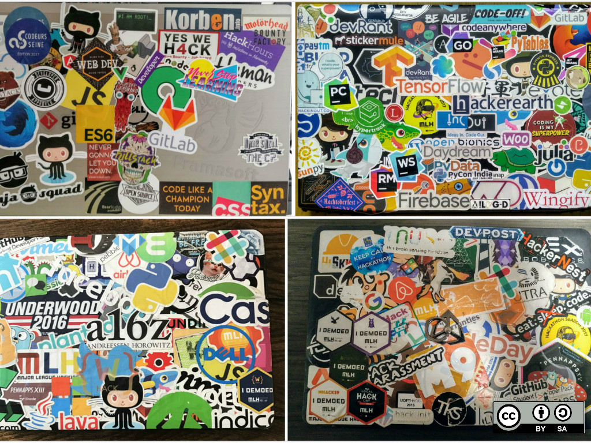

# Logo As Sticker License
See if you can use the very recognizable trademark/logo for (print and sell) commercial stickers.

## List

| Name | Commercial use | License | Statement |
|:-----|:--------------:|:--------|:---------:|
| [Angular](https://angular.io/assets/images/logos/angular/angular.svg) | ✔️ | [CC BY 4.0](https://creativecommons.org/licenses/by/4.0/) | [Link](https://angular.io/presskit) |
| Babel | ✔️ | [MIT](https://github.com/babel/logo/blob/master/LICENSE) | [Link](https://github.com/babel/logo) |
| Docker |❌🈸 | All Rights Reserved | [Link](https://www.docker.com/legal/trademark-guidelines) |
| ESLint | ❔ | - | [Link](https://js.foundation/about/governance/trademark-policy) |
| Git | ✔️ | [CC BY 3.0](https://creativecommons.org/licenses/by/3.0/) | [Link](https://git-scm.com/downloads/logos) |
| GitHub Logotype | ❌🈸 | All Rights Reserved | [Link](https://github.com/logos) |
| GitHub Logomark | ❌🈸 | All Rights Reserved | [Link](https://github.com/logos) |
| GitHub Octocat | ❌🈸 | All Rights Reserved | [Link](https://github.com/logos) |
| GitLab | ❌ | [CC BY-NC-SA 4.0](https://creativecommons.org/licenses/by-nc-sa/4.0/) | [Link](https://gitlab.com/gitlab-com/gitlab-artwork) |
| GraphQL | ❔ | - | - |
| Gulp | ✔️ | [CC0](https://creativecommons.org/publicdomain/zero/1.0/) | [Link](https://github.com/gulpjs/artwork) |
| HTML5 | ✔️ | [CC BY 3.0](https://creativecommons.org/licenses/by/3.0/) | [Link](https://www.w3.org/html/logo/)  |
| jQuery | ❔ | - | [Link](https://js.foundation/about/governance/trademark-policy) |
| Jenkins | ✔️ | [CC BY-SA 3.0](https://creativecommons.org/licenses/by-sa/3.0/) | [Link](https://wiki.jenkins.io/display/JENKINS/Logo) |
| JS | ✔️ | [MIT](https://github.com/voodootikigod/logo.js/blob/master/LICENSE) | [Link](https://github.com/voodootikigod/logo.js) |
| [MongoDB](https://webassets.mongodb.com/_com_assets/cms/mongodb-logo-rgb-j6w271g1xn.jpg) | ❌ | [All Rights Reserved](https://www.mongodb.com/legal/trademark-usage-guidelines) | [Link](https://www.mongodb.com/brand-resources) |
| Node.js | ❌🈸 | All Rights Reserved | [Link](https://nodejs.org/en/about/trademark/) |
| PostCSS | ✔️ | [CC BY 4.0](https://creativecommons.org/licenses/by/4.0/) | [Link](https://github.com/postcss/brand) |
| [Python](https://www.python.org/static/community_logos/python-logo-master-v3-TM.png) | 🈸 | [All Rights Reserved](https://www.python.org/psf/trademarks/#unaltered-logos) | [Link](https://www.python.org/psf/trademarks/) |
| [PHP](https://www.php.net/images/logos/new-php-logo.svg) | ✔️ | [CC BY-SA 4.0](https://creativecommons.org/licenses/by-sa/4.0/) | [Link](https://www.php.net/download-logos.php) |
| React | ❔ | - | - |
| [Redux](https://raw.githubusercontent.com/reduxjs/redux/master/logo/logo.png) | ✔️ | [CC0](https://creativecommons.org/publicdomain/zero/1.0/) | [Link](https://github.com/reduxjs/redux/tree/master/logo) |
| Sass | ❌ | [CC BY-NC-SA 3.0](https://creativecommons.org/licenses/by-nc-sa/3.0/) | [Link](http://sass-lang.com/styleguide/brand) |
| [TypeScript](https://raw.githubusercontent.com/Microsoft/TypeScript/master/doc/logo.svg) | ✔️ | [Apache-2.0](https://github.com/Microsoft/TypeScript/blob/master/LICENSE.txt) | [Link](https://github.com/Microsoft/TypeScript/blob/master/LICENSE.txt) |
| [TS](https://raw.githubusercontent.com/remojansen/logo.ts/master/ts.png) | ✔️ | [MIT](https://github.com/remojansen/logo.ts/blob/master/LICENSE) | [Link](https://github.com/remojansen/logo.ts) |
| Vue | ❌ | [CC BY-NC-SA 4.0](https://creativecommons.org/licenses/by-nc-sa/4.0/) | [Link](https://github.com/vuejs/art) |
| Webpack | 🈸 | [EULA](https://github.com/webpack/media/blob/master/LICENSE) | [Link](https://github.com/webpack/media) |
| Yarn | ✔️ | [CC BY 4.0](https://creativecommons.org/licenses/by/4.0/) | [Link](https://github.com/yarnpkg/assets) |

## License

To the extent possible under law, [Chawye Hsu](https://twitter.com/chawyehsu) has waived all copyright and related or neighboring rights to this work.

See [LICENSE](LICENSE) for more information.
